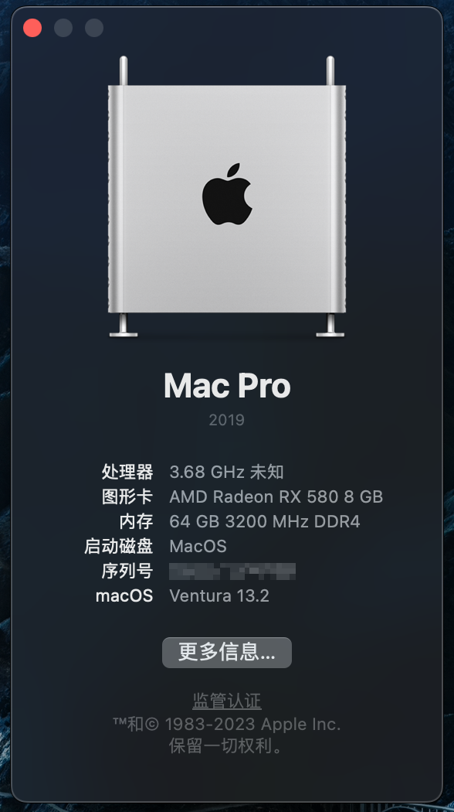
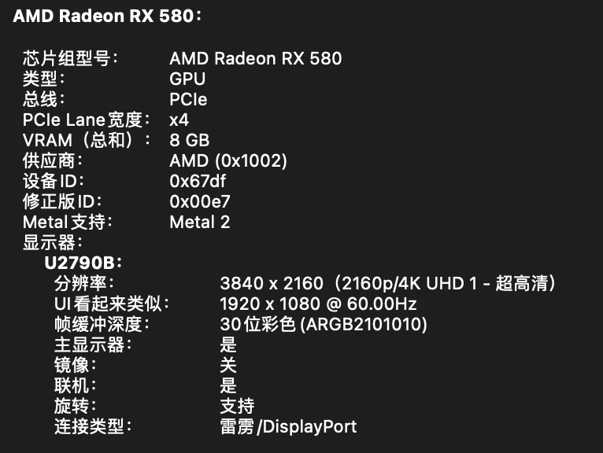
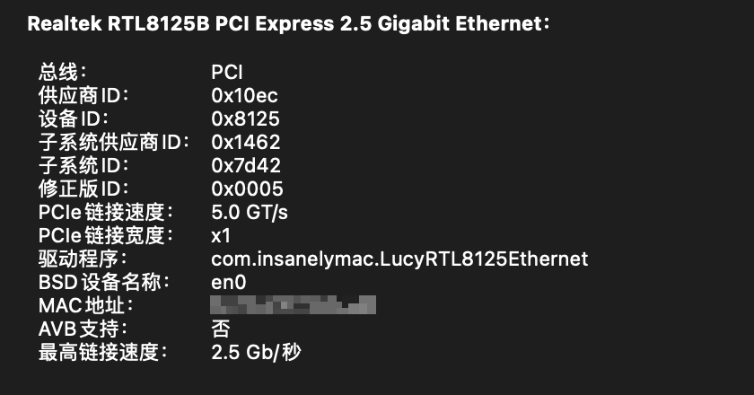
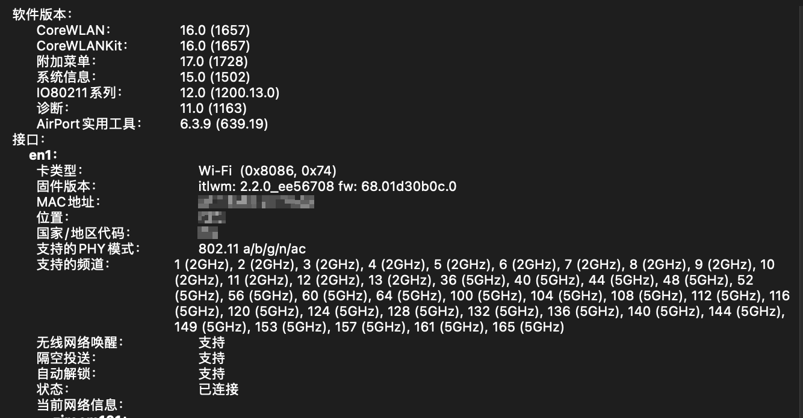

# MAG_B660M_MORTAR_WIFI_D4-12600KF-RX580-Hackintosh-OpenCore-EFI

微星 MAG B660M MORTAR WIFI DDR4 / i5-123600KF / RX580 / macOS 13 Ventura / 黑苹果 Hackintosh / OpenCore EFI

## 版本

>此EFI已尽量保持纯净，删减了官方模版中大量无用的样例，没有添加任何怪异的补丁，只添加必要的配置。OC最近几个版本的配置项变动非常频繁，有许多配置项的增删，不建议直接把旧的config.pdist复制过来用。

- OpenCore RELEASE 0.9.4
- 系统： macOS 13.4.1 Ventura

## 硬件配置

- 强烈建议**使用DP输出**
- CPU：i5-12600KF 开启全核，睿频约3.8GHz
- 独显：AMD Radeon RX 580
- 内存：2*32G 3200MHZ 正常
- 有线网卡：正常
- WiFi + 蓝牙：正常
- 音频：正常
- USB：正常
- 睡眠：正常

## 截图

